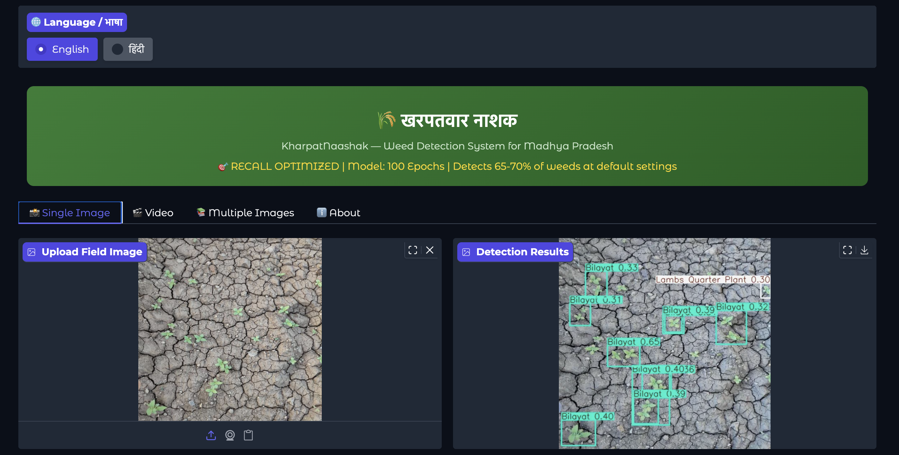
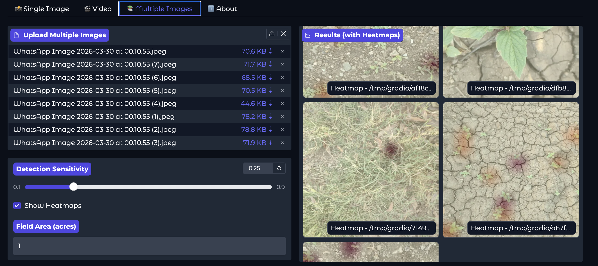
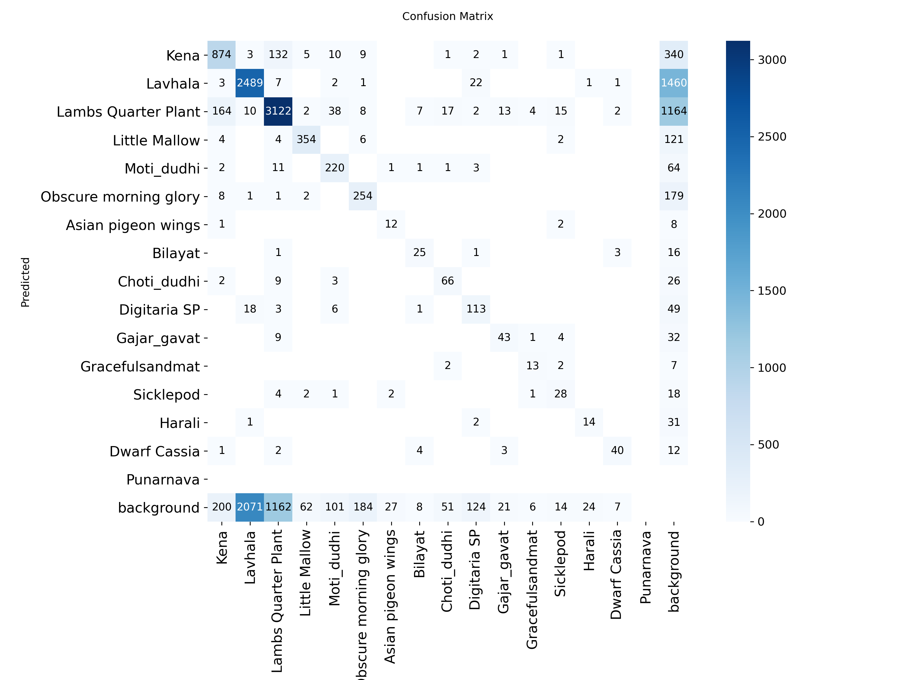
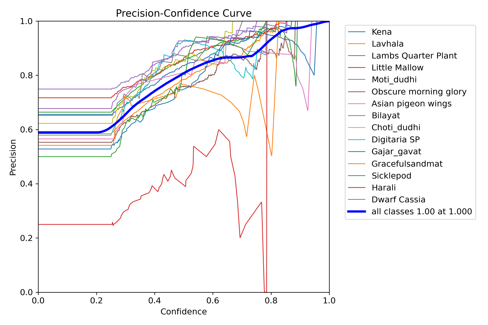
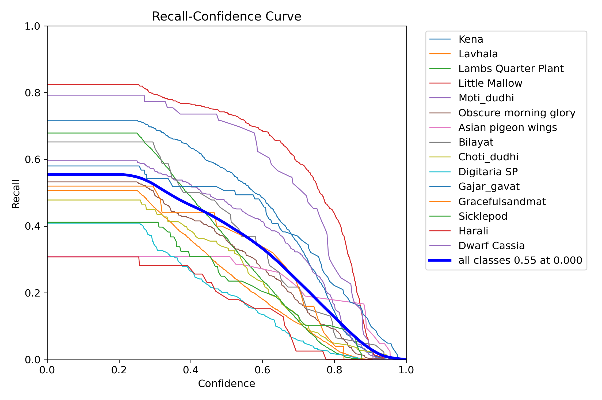
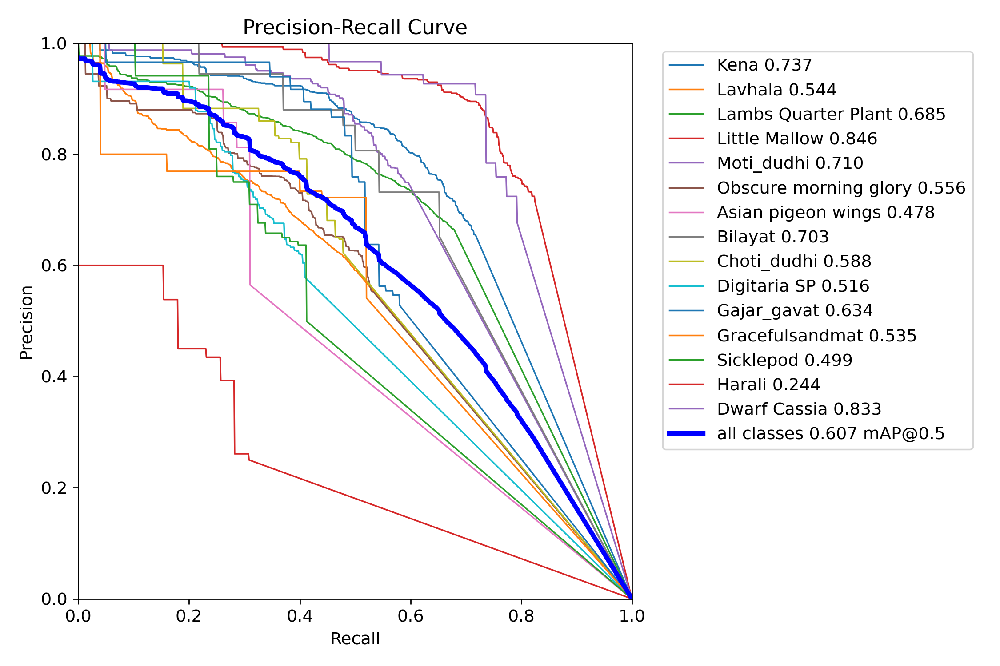
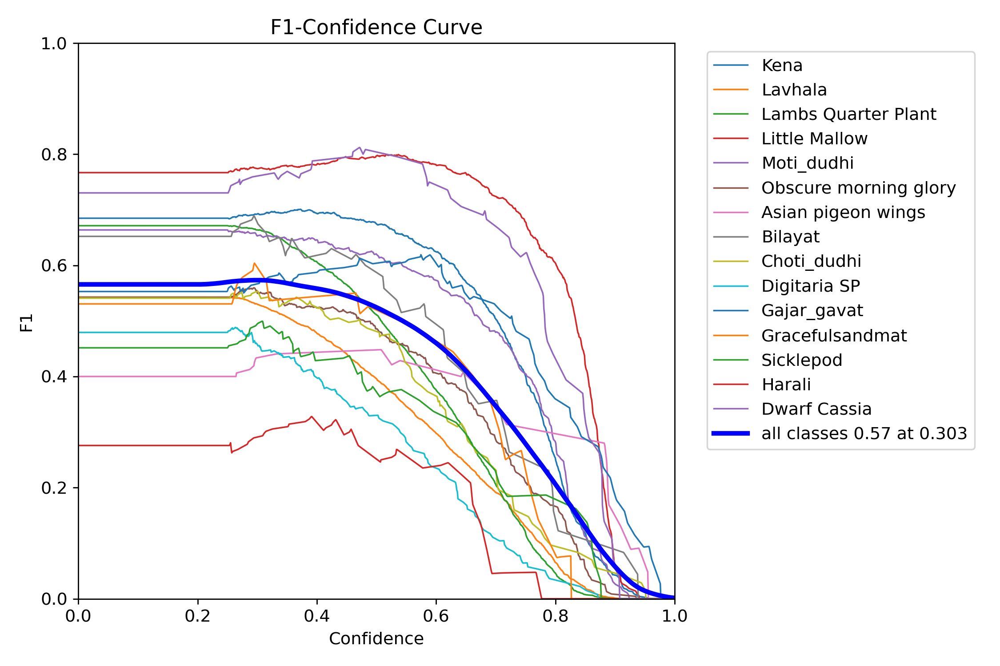

<div align="center">

# 🌾 KharpatNaashak
### खरपतवार नाशक — AI-Powered Weed Detection for Indian Agriculture

**Real-time, edge-friendly weed identification built for the farms that need it most.**

[](https://github.com/ultralytics/ultralytics)
[](https://www.python.org/)
[](LICENSE)
[](https://gradio.app/)
[](https://huggingface.co/spaces/mahi00/KharpatNaashak-Weed-Detection)

[**Live Demo**](https://huggingface.co/spaces/mahi00/KharpatNaashak-Weed-Detection) · [**Report Bug**](https://github.com/Mahi-S83/KharpatNaashak-Weed-Detection/issues) · [**Request Feature**](https://github.com/Mahi-S83/KharpatNaashak-Weed-Detection/issues)

</div>

---

## 📌 Table of Contents

- [Why This Exists](#-why-this-exists)
- [Demo](#-demo)
- [Key Features](#-key-features)
- [Dataset](#-dataset)
- [Model Architecture](#-model-architecture)
- [Performance](#-performance)
- [Project Structure](#-project-structure)
- [Installation](#️-installation)
- [Usage](#-usage)
- [Results](#-results)
- [Roadmap](#-roadmap)
- [Contributing](#-contributing)
- [License](#-license)
- [Acknowledgments](#-acknowledgments)

---

## 🌱 Why This Exists

Weeds account for an estimated **45% of annual productivity loss** in Indian agriculture. The usual fix — blanket herbicide spraying — is expensive, environmentally damaging, and drives herbicide resistance over time.

**KharpatNaashak** takes a different approach: identify exactly *which* weed is growing *where*, so herbicide goes only where it's needed. Less chemical, lower cost, healthier soil.

- ✅ Real-time detection across 16 weed species common to Indian soybean fields
- ✅ Estimated 60–70% herbicide reduction vs. blanket spraying
- ✅ A 5.5 MB model — light enough to eventually run at the edge, not just in the cloud

---

## 🎬 Demo

**[▶ Try the live demo on Hugging Face Spaces](https://huggingface.co/spaces/mahi00/KharpatNaashak-Weed-Detection)**

| Detection Output | Density Heatmap |
|:---:|:---:|
|  |  |
| Bounding boxes with species + confidence | 10×10 grid for precision spray zones |

---

## ✨ Key Features

### Core Detection

| Feature | Description |
|---|---|
| 🖼️ **Image Detection** | Upload a field photo, get labeled bounding boxes per weed species |
| 🎞️ **Video Processing** | Frame-by-frame analysis for MP4 / AVI / MOV footage |
| 📦 **Batch Processing** | Run detection across multiple images at once, results in a gallery view |
| 🔥 **Density Heatmap** | 10×10 grid visualization to plan targeted spray zones |

### Built for Farmers, Not Just Engineers

| Feature | Description |
|---|---|
| 🎚️ **Confidence Slider** | Plain-language sensitivity control — no ML jargon |
| 💰 **Cost Savings Calculator** | Estimated ₹ savings vs. blanket spraying |
| 📄 **PDF Report Generation** | Downloadable, shareable reports with farmer/field details |
| 📊 **Per-Species Breakdown** | Count and confidence score for every detected weed |

---

## 📊 Dataset

### MH-Weed16

| Parameter | Value |
|---|---|
| **Total Images Collected** | 25,797 |
| **Manually Annotated (bounding boxes)** | 6,626 |
| **Weed Species** | 16 |
| **Source** | Soybean fields, Maharashtra (July – Nov 2023) |
| **Annotation Format** | YOLO |
| **Train / Val Split** | 80 / 20 → 5,294 train / 1,332 val |

> **Note on scale:** Of the 25,797 raw images collected, 6,626 were manually annotated with bounding boxes for this training run — the annotated subset used for both the train and validation splits. The remaining images are a candidate pool for future annotation or semi-supervised expansion (see [Roadmap](#-roadmap)).

### The 16 Weed Species

| # | English Name | Hindi Name |
|---|---|---|
| 0 | Kena | केना |
| 1 | Lavhala | लव्हाळा |
| 2 | Lambs Quarter Plant | बथुआ |
| 3 | Little Mallow | छोटी खरपतवार |
| 4 | Moti Dudhi | मोती दूधी |
| 5 | Obscure Morning Glory | अस्पष्ट मॉर्निंग ग्लोरी |
| 6 | Asian Pigeon Wings | एशियाई कबूतर पंख |
| 7 | Bilayat | बिलायत |
| 8 | Choti Dudhi | छोटी दूधी |
| 9 | Digitaria SP | डिजिटेरिया |
| 10 | Gajar Gavat | गाजर गवत |
| 11 | Graceful Sandmat | ग्रेसफुलसैंडमैट |
| 12 | Sicklepod | सिकलपॉड |
| 13 | Harali | हराली |
| 14 | Dwarf Cassia | बौनी कैसिया |
| 15 | Punarnava | पुनर्नवा |

---

## 🧠 Model Architecture

### YOLOv11n (Nano)

| Parameter | Value |
|---|---|
| **Parameters** | 2.58M |
| **GFLOPs** | 6.3 |
| **Model Size** | 5.5 MB |
| **Inference Speed** | 13.5 ms (GPU) · 164 ms (CPU) |

```
┌──────────────────────────────────────────────────────────┐
│                   YOLOv11n Architecture                  │
├──────────────────────────────────────────────────────────┤
│  BACKBONE (Feature Extraction)                            │
│  Conv → C3k2 → Conv → C3k2 → ... → SPPF → C2PSA           │
│                        ↓                                   │
│  NECK (Feature Fusion)                                     │
│  Upsample → Concat → C3k2 → ... → Detect Head              │
│                        ↓                                   │
│  DETECT HEAD (16 Classes)                                   │
│  Bounding Boxes + Class Scores + Objectness                │
└──────────────────────────────────────────────────────────┘
```

| Component | Function |
|---|---|
| **C3k2 Blocks** | Efficient feature extraction via cross-stage partial connections |
| **SPPF** | Spatial pyramid pooling for multi-scale detection |
| **C2PSA** | Position-sensitive attention module |
| **Detect Head** | Outputs boxes, class scores, and objectness |

---

## 📈 Performance

### Overall Metrics (100 epochs)

| Metric | Value |
|---|---|
| **mAP@0.5** | **60.7%** |
| **mAP@0.5:0.95** | 33.2% |
| **Precision** | **67.1%** |
| **Recall** | **52.2%** |
| **F1 Score** | ~0.58 |

### Per-Class Performance

| Weed Species | mAP@0.5 | Precision | Recall |
|---|---|---|---|
| Little Mallow | **84.6%** | 75.6% | 79.4% |
| Dwarf Cassia | **83.3%** | 75.0% | 77.4% |
| Kena | **73.7%** | 69.4% | 68.9% |
| Moti Dudhi | **71.0%** | 77.8% | 56.4% |
| Bilayat | **70.3%** | 72.4% | 62.7% |
| Lambs Quarter Plant | **68.5%** | 72.0% | 61.6% |
| Gajar Gavat | **63.4%** | 59.4% | 54.3% |
| Choti Dudhi | **58.8%** | 71.8% | 44.2% |
| Obscure Morning Glory | **55.6%** | 62.7% | 48.9% |
| Lavhala | **54.4%** | 63.9% | 45.1% |
| Graceful Sandmat | **53.5%** | 71.5% | 50.4% |
| Digitaria SP | **51.6%** | 69.8% | 33.8% |
| Sicklepod | **49.9%** | 62.6% | 41.2% |
| Asian Pigeon Wings | **47.8%** | 72.9% | 31.0% |
| Harali | **24.4%** | 30.2% | 28.2% |

> Harali is the clear outlier — under-annotated and visually similar to neighboring species. It's the top priority in the [Roadmap](#-roadmap).


*Confusion matrix across all 16 weed species*

---

## 📂 Project Structure

```
KharpatNaashak-Weed-Detection/
│
├── app.py                              # Main Gradio web application
├── requirements.txt                    # Python dependencies
├── best.pt                             # Trained YOLOv11n model (5.5 MB)
│
├── notebooks/
│   ├── KharpatNaashak_Master.ipynb     # Complete UI notebook
│   ├── 2_Validation_Confusion_Matrix.ipynb
│   └── training/                       # Training notebooks
│
├── screenshots/
│   ├── detection_results.png
│   ├── heatmap.png
│   ├── confusion_matrix.png
│   ├── BoxP_curve.png
│   ├── BoxR_curve.png
│   └── architecture.png
│
├── data/
│   └── mh_weed_yolo/                   # Dataset (Google Drive)
│       ├── images/
│       │   ├── train/                  # 5,294 images
│       │   └── val/                    # 1,332 images
│       ├── labels/
│       │   ├── train/
│       │   └── val/
│       └── data.yaml
│
└── README.md
```

---

## 🛠️ Installation

### Prerequisites
- Python 3.10+
- Google Colab (for training) or a local GPU
- Google Drive (for dataset storage)

### Local Setup

```bash
git clone https://github.com/Mahi-S83/KharpatNaashak-Weed-Detection.git
cd KharpatNaashak-Weed-Detection

python -m venv venv
source venv/bin/activate      # Windows: venv\Scripts\activate

pip install -r requirements.txt
# Download best.pt from Google Drive or Hugging Face into the project root
```

### Dependencies
```
ultralytics
gradio
opencv-python
matplotlib
pillow
reportlab
numpy
torch
torchvision
```

---

## 🚀 Usage

### Run the Web App
```bash
python app.py
```
Launches a local URL (or a public one if running in Colab).

### Inference in Colab
```python
from google.colab import drive
drive.mount('/content/drive')

from ultralytics import YOLO

model = YOLO('/content/drive/MyDrive/path/to/best.pt')
results = model('image.jpg', conf=0.25)
results[0].show()
```

### Train from Scratch
```python
from ultralytics import YOLO

model = YOLO('yolo11n.pt')

results = model.train(
    data='/content/mh_weed_yolo/data.yaml',
    epochs=100,
    imgsz=640,
    batch=16,
    device=0,
    project='/content/drive/MyDrive/mh_weed_project',
    name='yolov11_mh_weed16'
)
```

---

## 📊 Results

### Training Progress

| Epochs | mAP@0.5 | Precision | Recall |
|---|---|---|---|
| 50 | 57.1% | 64.4% | 53.1% |
| 100 | **60.7%** | **67.1%** | **52.2%** |


*Precision vs. confidence threshold across all 16 classes*


*Recall vs. confidence threshold across all 16 classes*


*Precision-Recall curve across all 16 classes*


*F1 score vs. confidence threshold*

---

## 🔮 Roadmap

| Improvement | Expected Impact | Priority |
|---|---|---|
| Collect more Harali samples | +15–20% mAP on Harali | 🔴 High |
| Class-weighted loss | +5–10% mAP on rare classes | 🔴 High |
| Copy-paste augmentation | +5–8% recall on Harali | 🔴 High |
| Upgrade to YOLOv11s | +8–12% overall mAP | 🟡 Medium |
| Native mobile app (Android/iOS) | Wider farmer accessibility | 🟡 Medium |
| Drone integration | Real-time large-field scanning | 🟡 Medium |
| Upgrade to YOLOv12n | +1–2% mAP, slight speed cost | 🟢 Low |
| Species-specific herbicide recommendations | Actionable treatment guidance | 🟢 Low |

---

## 🤝 Contributing

Contributions are welcome!

1. Fork the repository
2. Create a feature branch (`git checkout -b feature/AmazingFeature`)
3. Commit your changes (`git commit -m 'Add some AmazingFeature'`)
4. Push to the branch (`git push origin feature/AmazingFeature`)
5. Open a Pull Request

---

## 📄 License

Licensed under the [MIT License](LICENSE).

---

## 🙏 Acknowledgments

**Dataset**
MH-Weed16 by Sayali Shinde and Dr. Vahida Attar (COEP Technological University Pune), published in *Data in Brief*, 2025. [Dataset link](https://data.mendeley.com/datasets/d3n3mgjjbv/2)

**Libraries**
[Ultralytics YOLOv11](https://github.com/ultralytics/ultralytics) · PyTorch · Gradio · OpenCV

**Contributors**
[Mahi-S83](https://github.com/Mahi-S83) — Project Lead

---

## 📝 Citation

```bibtex
@software{kharpatnaashak2024,
  author = {Mahi-S83},
  title  = {KharpatNaashak: Weed Detection System for Indian Agriculture},
  year   = {2024},
  url    = {https://github.com/Mahi-S83/KharpatNaashak-Weed-Detection}
}
```

---

<div align="center">

**Made with ❤️ for Indian Farmers 🌾**

[GitHub](https://github.com/Mahi-S83) · [Live Demo](https://huggingface.co/spaces/mahi00/KharpatNaashak-Weed-Detection)

⭐ If this project is useful to you, consider starring the repo!

</div>
